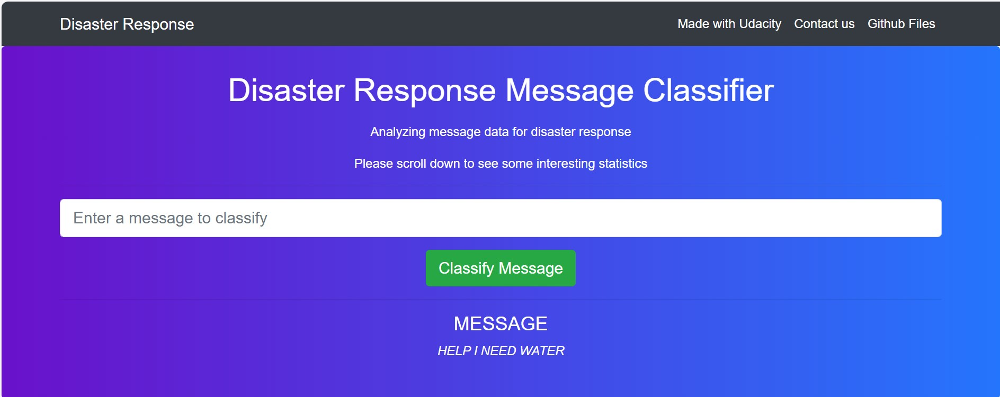
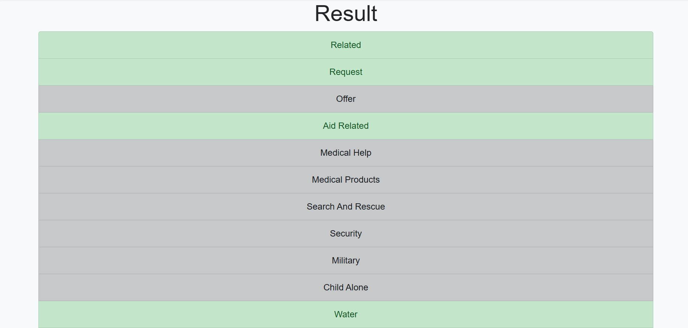
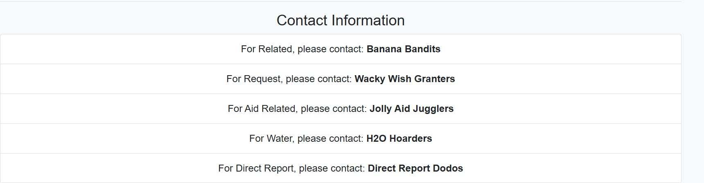
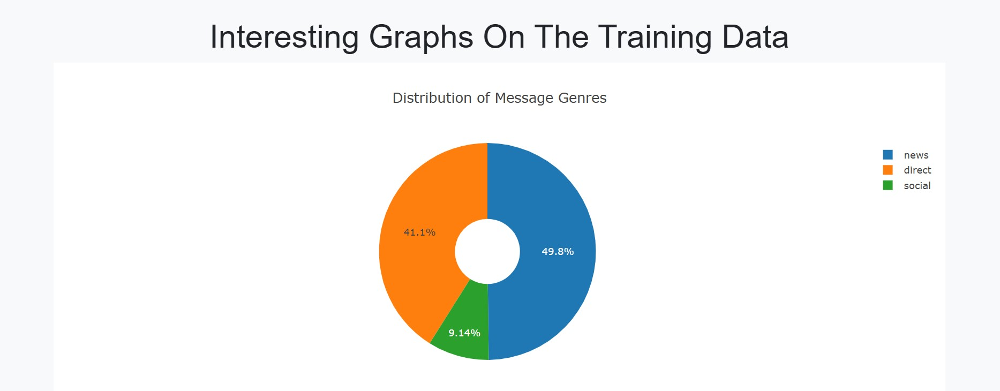
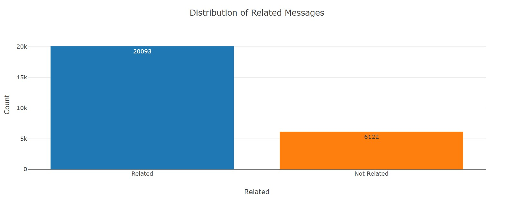
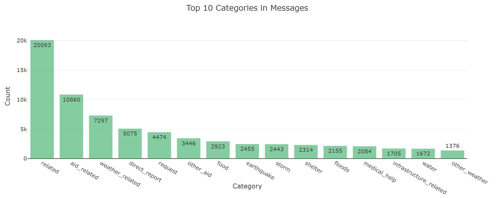
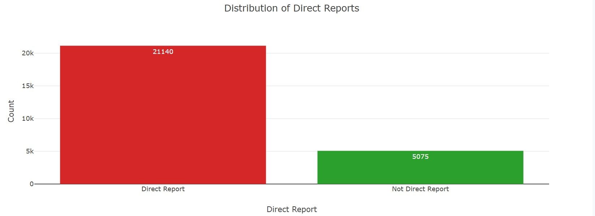

# Disaster Response Pipeline Project
# Project Overview

This project leverages machine learning to classify messages received during natural disasters into specific categories. The goal is to ensure that the right people or organizations can respond to each category effectively.

## Data Source

The model was trained on a dataset of over 25,000 real messages sent during disasters. This data was sourced from [FigureEight](https://www.figure-eight.com/), a platform known for providing high-quality labeled data for machine learning projects.

## Machine Learning Model

The machine learning model used in this project is designed to analyze and classify text messages. Here's a brief overview of the process:

1. **Data Preprocessing**: The messages are cleaned and preprocessed to remove noise and irrelevant information. This includes tokenization, lemmatization, and removing stop words.
2. **Feature Extraction**: Features are extracted from the text using techniques like Count Vectorization and TF-IDF (Term Frequency-Inverse Document Frequency).
3. **Model Training**: The processed data is used to train a machine learning model. In this case, a MultiOutputClassifier with a RandomForestClassifier is used to handle the multi-label classification problem.
4. **Model Evaluation**: The model's performance is evaluated using metrics like precision, recall, and F1-score to ensure it accurately classifies the messages.

The model that was selected was RandomForestClassifier. The average precision of the model over all message categories was **93%**.
The model was fine-tuned using [scikit-learn GridSearch](https://scikit-learn.org/stable/modules/generated/sklearn.model_selection.GridSearchCV.html). Also, a ML pipeline was employed using [scikit-learn Pipeline](https://scikit-learn.org/stable/modules/generated/sklearn.pipeline.Pipeline.html).

## Web Application

A web application dashboard was created using [Flask](http://flask.pocoo.org/) and [Plotly](https://plot.ly/) to provide an interactive interface for users. The dashboard has the following features:

1. **Message Classification**: Users can input new messages, and the model will predict the categories for each message. This helps in quickly identifying the type of assistance required.
2. **Visualization**: The dashboard uses Plotly to create interactive visualizations, such as bar charts and pie charts, to display the distribution of message categories. This helps in understanding the overall situation and the most common types of requests.
3. **Contact Information**: Based on the predicted categories, the dashboard displays the names of organizations that can handle specific types of requests. This ensures that the right resources are allocated to address each issue.

## Example Use Case

Imagine a scenario where a natural disaster, such as a hurricane, has struck a region. People in the affected area send messages requesting help. These messages might include requests for medical assistance, food, water, shelter, and more. The machine learning model classifies these messages into relevant categories, and the web application displays the results. Emergency responders can then use this information to prioritize and allocate resources effectively.

## Images to show the Web Application
### Classifcation Process
**From the following images one can see that a user input the message "HELP I NEED WATER!".**

**The models classify the message into a few green highlighted categories.** 

**From the next image one can see organisations that deal with specific categories.**

### Interesting graph based on the training data for the home page.






## Installation
This installation process is for a windows based machine, and might differ for Linux, Ubuntu or Mac devices. Please follow instruction accordingly.
1. First, clone the repository to your local machine, open a cmd prompt and then execute:
```
git clone https://github.com/Jarries/Udacity_DataScience_NanoDegree_2024.git
```
2. Then go into the Disaster Response Project folder by executing the following prompts:
```
cd '.\4.0 Data Engineering\Disaster Response Project\'
```
3. Create a virtual environment and activate it.

4. Download the necessary libraries by executing the following command:
```
pip install -r requirements.txt
```


## Usage:
1. Firstly you need to run the following commands in the project's root directory to set up your database and model.
- To run the ETL pipeline that cleans the data and stores the data in a database.
`python data/process_data.py data/disaster_messages.csv data/disaster_categories.csv data/DisasterResponse.db`
- To run ML pipeline that train the classifier and saves the pickle file.
`python models/train_classifier.py data/DisasterResponse.db models/classifier.pkl`

2. Go into the app folder to run the web application (You can not run this from the root directory):
```
cd app
python run.py
```

3. Open any browser and go to `http://127.0.0.1:3000/`

## Files in this project
- App folder that contains the necessary files to run the web application.
- Assets folder that contains the images shown in this README.md file.
- Data folder that contains the data used for the ETL pipeline, as well as the process_data.py file that process the data as explained above.
- Models folder that contains the train_classifier.py file that trains the model and saves the pickle file also in this folder.
- notebooks folder that contains the notebooks that I worked with to get to this point.
- requirements.txt file that contains the packages with version that should be installed to run this project.

## Future considerations and work
### Dataset Imbalance

In this project, the dataset used for training the machine learning model is imbalanced. This means that some categories, such as "water," have significantly fewer examples compared to others. Imbalanced datasets are common in real-world scenarios, especially in disaster response, where certain types of requests may be more frequent than others.

### Effects on Model Training

Imbalanced datasets can pose several challenges during model training:

1. **Bias Towards Majority Classes**: The model may become biased towards the majority classes, leading to high accuracy for those classes but poor performance for minority classes. This happens because the model learns to prioritize the more frequent categories to minimize the overall error.
2. **Poor Generalization**: The model may struggle to generalize well to new, unseen data, especially for the minority classes. This can result in lower recall for these categories, meaning the model might miss important instances of minority classes.
3. **Evaluation Metrics**: Standard evaluation metrics like accuracy can be misleading in the presence of imbalance. Metrics such as precision, recall, and F1-score become more relevant for assessing the model's performance.

### Emphasizing Precision or Recall

When dealing with imbalanced datasets, it's crucial to decide whether to emphasize precision or recall for each category based on the specific use case:

1. **Precision**: Precision is the ratio of true positive predictions to the total predicted positives. High precision means that when the model predicts a category, it is likely to be correct. Emphasizing precision is important when false positives are costly. For example, in medical help requests, a false positive might lead to unnecessary allocation of medical resources.
2. **Recall**: Recall is the ratio of true positive predictions to the total actual positives. High recall means that the model captures most of the actual instances of a category. Emphasizing recall is crucial when missing an instance is costly. For example, in search and rescue operations, missing a true positive could mean not providing timely help to someone in need.

### Balancing Precision and Recall

In practice, a balance between precision and recall is often desired. The F1-score, which is the harmonic mean of precision and recall, can be used to find this balance. Additionally, techniques such as:

- **Resampling**: Oversampling the minority classes or undersampling the majority classes to balance the dataset.
- **Class Weights**: Assigning higher weights to minority classes during model training to penalize misclassifications more heavily.
- **Ensemble Methods**: Using ensemble methods like Random Forests or Gradient Boosting that can handle class imbalance better.

These techniques can help improve the model's performance on imbalanced datasets.