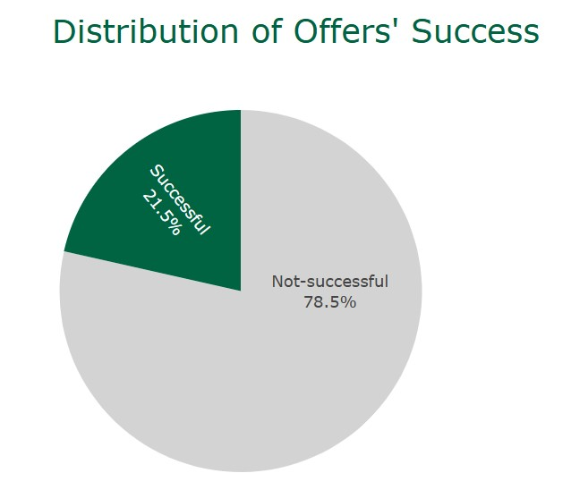
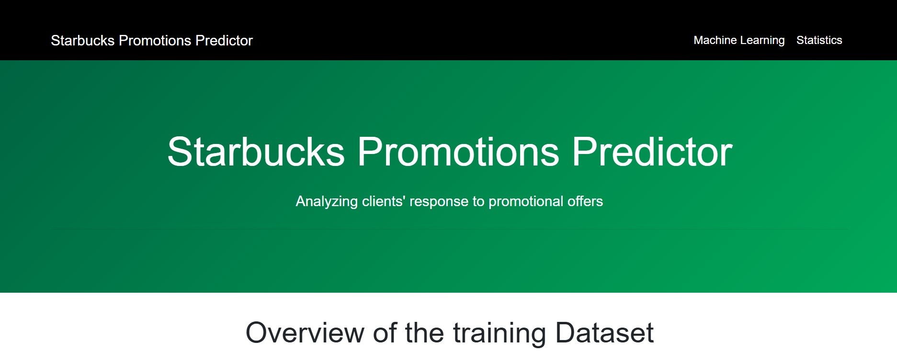
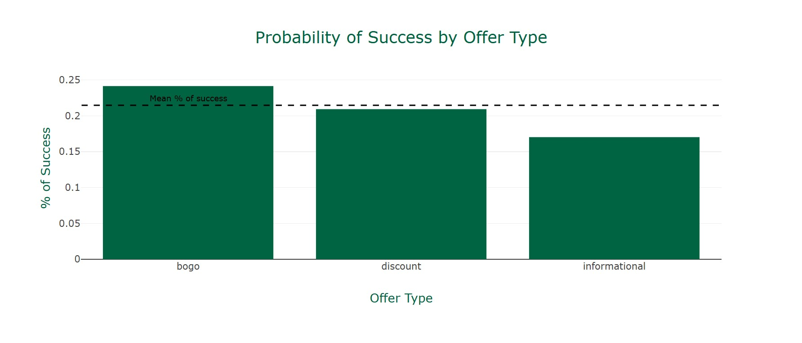
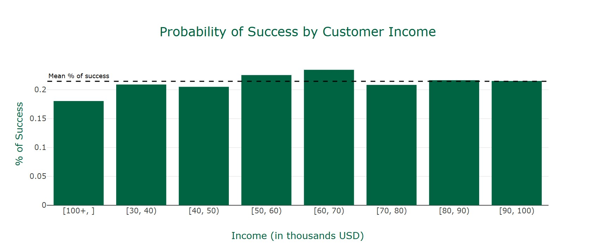
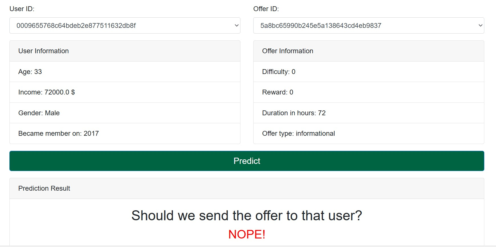

# Starbucks Capstone Project

## Project Overview

This project utilizes machine learning to predict whether a Starbucks customer will respond positively to a marketing offer. The dataset contains information about offers sent to clients through various channels, including 'web', 'social', 'email', and 'mobile'. The offers are categorized into three types:

1. **BOGO (Buy One Get One Free)**: Allows customers to receive a free item upon purchasing another item of equal or greater value.
2. **Discount**: Provides customers with a monetary discount on their purchase.
3. **Informational**: Serves as an advertisement to inform customers about new products, promotions, or events.

Additionally, the offers were valid for a specified number of days.

## Dataset and Task

The dataset records all transactions made by different clients. The task was to determine from these transactions which offers were successful and predict whether a client would respond positively to an offer.

For a company like Starbucks, which has millions of customers, these data insights can save thousands of dollars annually. Knowing which users to send offers to (and which users not to) can increase revenues and reduce costs.

## Strategy

To address the challenge, the strategy involved:

1. **Data Gathering**: Collecting all transaction data and linking it to the offer characteristics and user attributes.
2. **Feature Engineering**: Combining various attributes from the dataset to create new features.
3. **Model Building**: Constructing different machine learning models and comparing them using various metrics (detailed in the "Insights" section).
4. **Model Fine-Tuning**: Selecting the best-performing model and optimizing its parameters for maximum performance.
5. **Web Application Development**: Building a web application that allows users to select an offer ID and predict its success using the trained machine learning model.

## Project Components

- **Data Analysis**: Analyzing the dataset to understand customer behavior and offer effectiveness.
- **Machine Learning Model**: Training a model to predict the success of offers when sent to specific customers.
- **Web Application**: Developing an application to present the results and facilitate user interaction with the model.


## Insights

### Preprocessing

The data preprocessing phase presented several challenges. Firstly, the cleaning and data engineering process required careful planning and meticulous execution. For each event in the dataset, we had to consider various factors: the sequence of preceding and following events, the outcome of each event, and the time it occurred. The complexity increased because a customer could make multiple purchases, not necessarily related to a previously sent offer. Additionally, different offers had varying definitions of 'success'. Specifically, 'Informational' offers, which are advertisements, had no associated rewards or 'event completed' tags.

To determine which offers were successful, I employed the following strategy:

### Offer Types and Success Criteria

#### BOGO and Discount Offers

For BOGO and Discount offers to be considered successful, the following sequence of events needed to occur:

1. **Offer Received**
2. **Offer Viewed**
3. **Offer Completed**
4. **Transaction**

#### Informational Offers

For Informational offers, which are purely advertisements, the success criteria were slightly different due to the absence of rewards and 'offer completed' events. The necessary steps were:

1. **Offer Received**
2. **Offer Viewed**
3. **Transaction**

By following these steps, we could accurately determine the success of different offer types and gain valuable insights into customer behavior.


### Data Engineering

Here are the data engineering actions that I executed on the combined dataset. 

#### Transcript 
In the dataset containing the events, I performed the following data engineering actions:

- **User Data Filtering**: I included only the data related to users present in the profile section of the dataset. Since we lacked information about additional users, they were excluded from the analysis.
- **Offer ID Column Creation**: I created a column named 'offer_id' to store the offer ID extracted from each event. For events of type 'transaction' that did not have an offer ID, a temporary value of "null" was assigned.
- **Event Sequence for Offer Success**: As mentioned earlier, a specific order of events was used to determine the success of different offer types. Additionally, the transaction had to occur within a specified timeframe to be considered successful.
- **Column and Duplicate Removal**: I dropped several columns that did not provide significant information, such as the offer_id or the event time (since it had already been used to determine offer success). I also removed any duplicate rows from the dataset.

#### Profile
For the 'became_member_on' column, which indicated the date the user started using the application, I performed the following steps:

1. **Day of the Week Extraction**: I extracted the day of the week the user became a member. This information can help determine if the user is likely to be a recurrent buyer, based on whether they joined on a weekday or a weekend.
2. **Year Extraction and Dummy Variable Creation**: I extracted the year the user became a member and converted this variable into dummy variables.

Additionally, I converted the 'gender' column into dummy variables.
    

#### Portfolio
For the part of the dataset containing information about the different offers, I performed the following actions:

- **Dummy Variable Creation for Offer Type**: I converted the offer type into dummy variables.
- **Source Extraction and Column Creation**: I extracted the list of sources used to send the offers and created four separate columns for these sources. Each column has a value of 1 or 0, indicating whether the source was used for a given offer ID.
- **Duration Transformation**: I multiplied the duration by 24 to convert the value from days to hours.

#### Final Table Structure
I ended up with the following schema for the dataset:

| Column Name                | Description                                      |
|----------------------------|--------------------------------------------------|
| age                        | Age of the user (in years)                       |
| income                     | Income of the user (in USD)                      |
| weekday_membership         | Weekday (value from 1 to 7) when the user became a member |
| gender_F                   | 1 if the user is female, 0 otherwise             |
| gender_M                   | 1 if the user is male, 0 otherwise               |
| gender_O                   | 1 if the gender is 'other', 0 otherwise          |
| became_member_on_2013      | 1 if the user became a member in 2013, 0 otherwise |
| became_member_on_2014      | 1 if the user became a member in 2014, 0 otherwise |
| became_member_on_2015      | 1 if the user became a member in 2015, 0 otherwise |
| became_member_on_2016      | 1 if the user became a member in 2016, 0 otherwise |
| became_member_on_2017      | 1 if the user became a member in 2017, 0 otherwise |
| became_member_on_2018      | 1 if the user became a member in 2018, 0 otherwise |
| difficulty                 | Amount the user has to spend for the offer       |
| reward                     | Reward given to the user if they complete the offer |
| email                      | 1 if the offer was sent by email, 0 otherwise    |
| mobile                     | 1 if the offer was sent by mobile, 0 otherwise   |
| social                     | 1 if the offer was sent on social media, 0 otherwise |
| web                        | 1 if the offer was sent on the web, 0 otherwise  |
| duration_hours             | Duration in hours where the offer is active      |
| offer_type_bogo            | 1 if the offer is "BOGO", 0 otherwise            |
| offer_type_discount        | 1 if the offer is a discount, 0 otherwise        |
| offer_type_informational   | 1 if the offer is an advertisement, 0 otherwise  |
| successful_offer           | 1 if the offer is considered successful, 0 otherwise |
    

### Post Processing

After identifying which offers to tag as successful, I noticed a significant imbalance in the dataset. Approximately 22% of the offers were successful, while the remaining 78% were not. To address this imbalance, I employed an "oversampling" strategy. This involved duplicating some of the data points to ensure that the final dataset had a balanced distribution of target classes.


### Machine Learning

For the machine learning part, I tested an compared the performance of several algorithms. Those experiements were made on the balanced dataset, ie that the two target classes, successful or not successful, were equally distributed. Here are the results:

<table>
  <tr>
    <th rowspan="2"><br>Algorithm</th>
    <th colspan="3">Training </th>
    <th colspan="3">Testing</th>
  </tr>
  <tr>
    <td>Accuracy</td>
    <td>Recall</td>
    <td>Precision</td>
    <td>Accuracy</td>
    <td>Recall</td>
    <td>Precision</td>
  </tr>
  <tr>
    <td>Logistic Regression</td>
    <td>59%</td>
    <td>70%</td>
    <td>58%</td>
    <td>59%</td>
    <td>70%</td>
    <td>57%</td>
  </tr>
  <tr>
    <td>Decision Tree</td>
    <td><b>94%</b></td>
    <td>98%</td>
    <td><b>91%</b></td>
    <td>77%</td>
    <td>90%</td>
    <td>72%</td>
  </tr>
  <tr>
    <td>Random Forest</td>
    <td><b>94%</b></td>
    <td><b>99%</b></td>
    <td>90%</td>
    <td><b>82%</b></td>
    <td><b>92%</b></td>
    <td><b>76%</b></td>
  </tr>
  <tr>
    <td>Gradient Boosting</td>
    <td>60%</td>
    <td>70%</td>
    <td>59%</td>
    <td>60%</td>
    <td>70%</td>
    <td>58%</td>
  </tr>
  <tr>
    <td>AdaBoost</td>
    <td>59%</td>
    <td>67%</td>
    <td>58%</td>
    <td>59%</td>
    <td>67%</td>
    <td>57%</td>
  </tr>
  <tr>
    <td>XGBoost</td>
    <td>64%</td>
    <td>73%</td>
    <td>61%</td>
    <td>62%</td>
    <td>71%</td>
    <td>60%</td>
  </tr>
</table>


As observed, the Random Forest Classifier is the best-performing model. However, it exhibits overfitting, with a training accuracy of around 94% and a testing accuracy of around 82%. To address this, we will perform hyperparameter tuning to find a better model. 

In this particular problem, we prioritize recall over precision. We believe it is better to send offers to all clients who might be influenced by them, even if it means also sending offers to clients who will not respond positively. Over time, this strategy should increase revenues more than it increases the costs associated with additional offers. The model with the best recall metric was the Random Forest Classifier.

#### Random Forest Classifier

The Random Forest Classifier can be described as follows:

A group of decision trees are combined to work as an *ensemble*. In each iteration, each individual tree in the random forest makes a class prediction. The most popular prediction among the ensemble is used as the final prediction of the model. The "random" aspect of the model comes from using a random subset of features to make predictions. This approach prevents some trees from becoming highly correlated, ensuring the model adjusts its predictions effectively.


### Optimization

The best model was a RandomForestClassifier, with an accuracy of 94% on the training set and 82% on the testing set (using the balanced dataset). This difference between training and testing accuracy indicates that the model is experiencing *overfitting*. To improve the model's performance, we used [scikit-learn GridSearch](https://scikit-learn.org/stable/modules/generated/sklearn.model_selection.GridSearchCV.html).

Specifically, we experimented with different values for the "depth" of the tree, which determines how deeply the tree can split to separate the data points. This parameter is crucial for reducing overfitting. The more splits the algorithm makes, the more it tends to overfit the data, essentially "memorizing" the training data. This results in high training accuracy but poor generalization to new, unseen data due to over-specialization.

The hyper-parameters that I chose to optimize are the following:

    'n_estimators': [100, 300],  # Number of trees in the forest
    'criterion': ['gini'],  # Function to measure the quality of a split
    'max_depth': [None, 10, 20],  # Maximum depth of the tree
    'min_samples_split': [2, 5],  # Minimum number of samples required to split an internal node
    'min_samples_leaf': [1, 2],  # Minimum number of samples required to be at a leaf node
    'min_weight_fraction_leaf': [0.0],  # Minimum weighted fraction of the sum total of weights required to be at a leaf node
    'max_features': ['log2', 'sqrt'],  # Number of features to consider when looking for the best split
    'max_leaf_nodes': [None],  # Unlimited number of leaf nodes
    'min_impurity_decrease': [0.0],  # Minimum decrease in impurity required for a split
    'bootstrap': [True],  # Whether bootstrap samples are used when building trees
    'oob_score': [False],  # Whether to use out-of-bag samples to estimate the generalization accuracy
    'n_jobs': [None],  # Number of jobs to run in parallel
    'random_state': [random_state],  # Random state for reproducibility
    'verbose': [0],  # Controls the verbosity when fitting and predicting
    'warm_start': [False],  # Reuse the solution of the previous call to fit and add more estimators to the ensemble
    'class_weight': [None],  # Weights associated with classes
    'ccp_alpha': [0.0],  # Complexity parameter used for Minimal Cost-Complexity Pruning
    'max_samples': [None]  # Number of samples to draw from X to train each base estimator
    
    
Also, it's important that this algorithm has a random part to it, as mentionned above. Therefore, we chose a fixed random state for our training, so that the model would give the same results each time.

We also chose a Cross Validation equal to 3. Cross validation is the process of separating the dataset into subsets, (for training and testing dataset), and performing the validation on each of those. That process is repeated "k" times (in our case k=5). The final performance is determined by the average performance obtained on each subset. Also, the metric that we used in the fine-tuning process was the area under ROC curve, so that the balance between the accuracy and the recall is optimized.


<table>
  <tr>
    <th rowspan="2"><br>Algorithm</th>
    <th colspan="3">Training </th>
    <th colspan="3">Testing</th>
  </tr>
  <tr>
    <td>Accuracy</td>
    <td>Precision</td>
    <td>Recall</td>
    <td>Accuracy</td>
    <td>Precision</td>
    <td>Recall</td>
  </tr>
  <tr>
  <tr>
    <td>Random Forest</td>
    <td>94%</td>
    <td>99%</td>
    <td>90%</td>
    <td>82%</td>
    <td>92%</td>
    <td>76%</td>
  </tr>
    
   <tr>
    <td>Random Forest Optimized</td>
    <td>95%</td>
    <td>99%</td>
    <td>90%</td>
    <td>82%</td>
    <td>92%</td>
    <td>77%</td>
  </tr>

</table>


## Improvements

Several adjustments could be made to improve the results:

1. **Enhanced Feature Engineering**:
    - Calculate the average amount spent by each user on their purchases.
    - Track the number of offers each user received.
    - Explore additional features that could provide deeper insights and improve the model's performance.
    
2. **Refine Offer Success Determination**:
    - Instead of checking for events directly following one another, consider the timestamps of different actions.
    - Ensure that the required sequence of events occurs within a valid time interval, even if other unrelated events happen in between.

## Installation

To download the repository, open a cmd prompt and execute 

Note: This code is for a Linux Machine. Please adapt to your machine.
```
git clone https://github.com/Jarries/Udacity_DataScience_NanoDegree_2024.git
```

Move into the Capstone project folder:

```
cd Capstone\ Project/
```

Create a virtual environment and activate it. For info on how to do this, click [here](https://uoa-eresearch.github.io/eresearch-cookbook/recipe/2014/11/26/python-virtual-env/).


Download and install the necessary required libraries:

```
pip install -r requirements.txt
```

## Usage:
1. Run the following commands in the project's root directory to set up your database and model.

    - To run ETL pipeline that cleans data and saves the data in a CSV file:
      ```
        python data/data_processing.py data/portfolio.json data/profile.json data/transcript.json
      ```
    - To run ML pipeline that trains classifier and saves it:
        ```
        python models/train_classifier.py data/cleaned_data.csv models/random_forest_classifier.pkl
        ```

2. Move into the app folder and run the application:
    ```
    cd app
    python run.py
    ```

3. Open a browser, and go to `http://127.0.0.1:3000/` to view the web application.


## Files

- `app`
    - `run.py` : Contains the main python file that runs the Flask application.
    - `templates` : Folder that contains the HTML files used in the Web app.
    
- `data`
    - `portfolio.json`: JSON file containing the information about the offers.
    - `profile.json`: JSON file containing the information about the users.
    - `transcript.json`: JSON file containing all events related to the users and the offers.
    - `data_processing.py`: Python file that loads, cleans, engineers, and saves the data into CSV files.

- `models`
    - `train_model.py`: Python file that loads the engineered data, trains and optimize a machine leaning model, and saves the trained model.
    
- `README.md`: File that describes the project and how to use it.

- `Starbucks_Capstone_Notebook.ipynb`: Jupyter Notebook that contains the data engineeering and data analysis, as well as the code used to train and test the selected machine learning models. This was the notebook used to develop all this.

- `requirements.txt`: Text file that contains all the Python packages necessary to run the code and the Web application.

## Web Application
### Overview

The Starbucks Offer Predictor web app is designed to help predict whether a customer will respond positively to a marketing offer. This tool leverages a machine learning model trained on historical data to provide insights into customer behavior and optimize marketing strategies.

### Features

- **User-Friendly Interface**: The web app features an intuitive interface that allows users to easily input offer details and customer information.
- **Real-Time Predictions**: Users can select an offer ID and input customer attributes to get real-time predictions on the likelihood of a successful offer.
- **Detailed Insights**: The app provides detailed insights into the factors influencing the prediction, helping marketers understand customer preferences better.

### How It Works

1. **Input Offer Details**: Users start by selecting an offer ID.
2. **Input Customer Information**: Users then select a customer ID.
3. **Get Prediction**: The app uses the trained machine learning model to predict whether the customer will respond positively to the offer. The prediction is displayed in terms of a Yes or No.
4. **Analyze Results**: Users can analyze the trained data on the statistics page.


### Some cool screenshots to show the web application.





## Libraries Used

- [Flask: Web Development framework](https://palletsprojects.com/p/flask/)

- [scikit-learn: Machine Learning](https://scikit-learn.org/stable/)  

- [Pandas: Data Analysis](https://pandas.pydata.org/)  

- [Numpy: Scientific Computing](http://www.numpy.org/)  

- [Matplotlib: Data Visualization](https://matplotlib.org/)  

- [seaborn: Data Visualization](https://seaborn.pydata.org/) 

- [jupyter: Interactive Notebook](https://jupyter.org/)

 -[WTForms: Forms API for Flask Web Development](https://pypi.org/project/WTForms/)

- [imbalanced-learn: Data Analysis library to deal with imbalanced dataset](https://imbalanced-learn.readthedocs.io/en/stable/)

- [xgboost: Gradient Boosting library](https://xgboost.readthedocs.io/en/latest/)

## Refrerences
- [Udacity DSND Term 1](https://github.com/udacity/DSND_Term1)
- [Bootstrap in Flask](https://john.soban.ski/pass-bootstrap-html-attributes-to-flask-wtforms.html)
- [Flask Boilerplate](https://github.com/MaxHalford/flask-boilerplate)
- [Understanding Random Forest](https://towardsdatascience.com/understanding-random-forest-58381e0602d2)
- [Udacity DSND Term 2](https://github.com/udacity/DSND_Term2)
